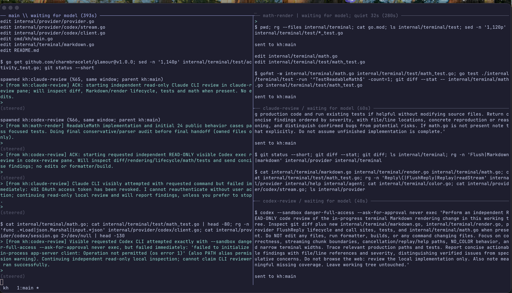

# kh

A terminal coding assistant in Go: chat, run shell commands, edit files, and delegate work to native tmux agents.



## Setup

Requires Go 1.24+ and Unix with `/bin/bash`. Install tmux for interactive chat; one-shot tasks do not require it.

From this checkout:

```bash
go build -o kh ./cmd/kh
./kh login codex                 # ChatGPT login; no API key
```

## Use

```bash
./kh                            # interactive chat
./kh "fix the failing tests"     # one-shot task
./kh -i "fix the failing tests"  # task, then stay in chat
./kh -r                         # resume this folder's latest session
./kh --sessions                 # list saved sessions
./kh -s SESSION_ID              # resume a specific session
```

**Enter** sends; **Shift+Enter** starts a new line (shown with a `... ` continuation prompt) without sending. Earlier lines stay in the draft until Enter sends the whole message. **Ctrl-J** also starts a new line if your terminal cannot distinguish Shift+Enter from Enter.

**Ctrl-C** discards the draft and stops a task; **Ctrl-D** on an empty line quits. **Up/Down** recall and navigate input history. Type while kh works to steer it.

Run `./kh --help` for CLI options; use `/help` in chat for commands. Attach a local image with `/image path/to/image.png`, or use `/image` for the macOS clipboard (requires Swift).

## Updates

Session startup automatically rebuilds the invoked executable from local sources and runs the new build. This requires Go, the kh source checkout, and a writable executable directory. Set `KH_SOURCE_DIR=/path/to/kshitij-harness` if sources moved, or `KH_AUTO_REBUILD=0` to skip rebuilding. Failed builds stop startup without replacing the old binary. Existing running chats are unchanged; restart and resume to use updates.

## Configuration and safety

Optionally create `~/.kh/config.json`, specifying only overrides:

```json
{ "effort": "high" }
```

CLI flags override configuration. Recognized read-only shell commands run without asking; other commands require approval. `--auto` skips approvals but does not disable sandboxing.

Only macOS has an OS-level shell sandbox, restricting writes to the project and allowed directories. `--nosandbox` permits shell writes outside the project. On other Unix systems, approvals still apply but are not a security boundary.

## Memory and agents

kh automatically saves lasting rules and learned gotchas in `~/.kh/memory.db`, with repo-specific and global memory. Saved chats live in `~/.kh/sessions`.

Ask kh to delegate work using native agents. Workers share project files: assign separate files or coordinate edits. Their tmux panes close after successful tasks; failures stay visible, and `keep` retains a worker for follow-ups.
